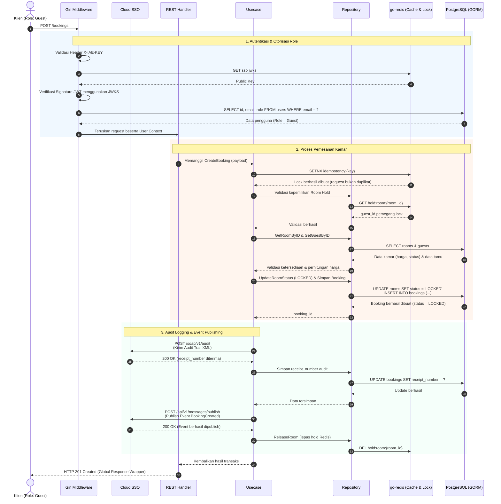

```mermaid
sequenceDiagram
    autonumber
    actor Guest as Klien (Role: Guest)
    participant MW as Gin Middleware
    participant Cloud as Cloud SSO
    participant Handler as REST Handler
    participant UC as Usecase
    participant Repo as Repository
    participant Redis as go-redis (Cache & Lock)
    participant DB as PostgreSQL (GORM)

    Guest->>MW: POST /bookings

    rect rgb(240, 248, 255)
        Note over MW, DB: 1. Autentikasi & Otorisasi Role
        MW->>MW: Validasi Header X-IAE-KEY
        MW->>Redis: GET sso jwks
        Redis-->>MW: Public Key 
        MW->>MW: Verifikasi Signature JWT menggunakan JWKS
        MW->>DB: SELECT id, email, role FROM users WHERE email = ?
        DB-->>MW: Data pengguna (Role = Guest)
        MW->>Handler: Teruskan request beserta User Context
    end


    rect rgb(255, 245, 238)
        Note over Handler, DB: 2. Proses Pemesanan Kamar
        Handler->>UC: Memanggil CreateBooking (payload)
        %% Validasi Idempotency
        UC->>Redis: SETNX idempotency:{key} 
        Redis-->>UC: Lock berhasil dibuat (request bukan duplikat)
        %% Validasi Hold Room
        UC->>Repo: Validasi kepemilikan Room Hold
        Repo->>Redis: GET hold:room:{room_id}
        Redis-->>Repo: guest_id pemegang lock
        Repo-->>UC: Validasi berhasil
        %% Ambil Data Room & Guest, Hitung Harga
        UC->>Repo: GetRoomByID & GetGuestByID
        Repo->>DB: SELECT rooms & guests
        DB-->>Repo: Data kamar (harga, status) & data tamu
        Repo-->>UC: Validasi ketersediaan & perhitungan harga
        %% Lock Room di Database & Simpan Booking
        UC->>Repo: UpdateRoomStatus (LOCKED) & Simpan Booking
        Repo->>DB: UPDATE rooms SET status = 'LOCKED' <br/> INSERT INTO bookings (...)
        DB-->>Repo: Booking berhasil dibuat (status = LOCKED)
        Repo-->>UC: booking_id
    end


    rect rgb(245, 255, 250)
        Note over UC, Cloud: 3. Audit Logging & Event Publishing
        %% SOAP Audit
        UC->>Cloud: POST /soap/v1/audit <br/>(Kirim Audit Trail XML)
        Cloud-->>UC: 200 OK (receipt_number diterima)
        %% Update Receipt
        UC->>Repo: Simpan receipt_number audit
        Repo->>DB: UPDATE bookings SET receipt_number = ?
        DB-->>Repo: Update berhasil
        Repo-->>UC: Data tersimpan
        %% Publish Event
        UC->>Cloud: POST /api/v1/messages/publish <br/>(Publish Event BookingCreated)
        Cloud-->>UC: 200 OK (Event berhasil dipublish)
        %% Release Hold
        UC->>Repo: ReleaseRoom (lepas hold Redis)
        Repo->>Redis: DEL hold:room:{room_id}
    end


    UC-->>Handler: Kembalikan hasil transaksi
    Handler-->>Guest: HTTP 201 Created (Global Response Wrapper)
```
